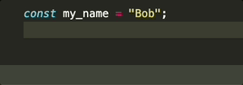

# Unquote

Removes the quotes around the selected text.

By default, if the cursor is within quoted text even if no text is selected, the quotes will be removed. The text without the quotes will then be selected, so you can easily change it to different quotes.

You can also disable this function to remove quotes without selecting text in the configuration.

## DEMO

## Default Keybind

- Win: `ctrl` + `shift` + `7`
- macOS: `cmd` + `shift` + `7`

## Extension Settings

### Unquote without selection

If there is no text selected but the cursor is in a quoted string, it attempts to remove the quotes.

The default for this setting is enabled.

## Release Notes

See [CHANGELOG](CHANGELOG.md)

